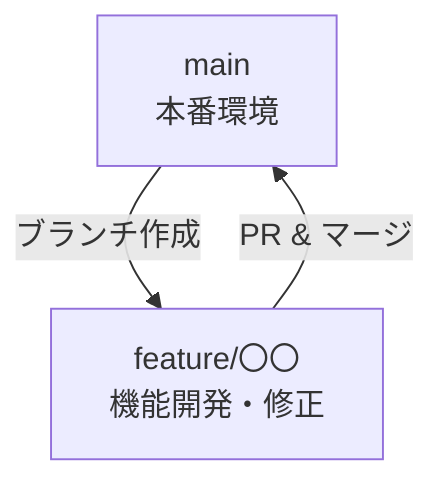

# CONTRIBUTING.md

このドキュメントは、sandoro プロジェクトにコントリビュートする際のガイドです。

AI エージェント向けの手順は以下を参照してください：
- `AGENTS.md`: 全AI共通のガイドライン
- `CLAUDE.md`: Claude Code 向け補足

全員が共通で従う恒久ルールは `RUNBOOK.md` に記載されています。

## プロジェクト概要

sandoro は、ASCII アートアニメーション付きのポモドーロタイマーです：
- **CLI 版**: Rust + ratatui で実装
- **Web 版**: React + TypeScript + Tailwind CSS で実装
- **共有リソース**: テーマ、スキーマ、アイコンデータ

## 基本方針

### 人間の役割
- **重要な意思決定**: アーキテクチャ選択、仕様の判断、優先順位の決定
- **計画の策定**: PLAN.md の作成と更新
- **ルールの管理**: RUNBOOK.md を最新状態に保つ
- **レビューと承認**: AIが作成したコードの品質確認
- **本番操作**: 本番環境に影響する操作の最終承認

### 開発の基本ルール
- すべての変更は Pull Request 経由でレビューを受ける
- 本番環境に影響する操作（デプロイ、リソース削除など）はレビューと承認を得てから実施
- RUNBOOK に記載されていない新しいルールは、チームで合意してから追加する

## 開発環境のセットアップ

### 前提条件
- [mise](https://mise.jdx.dev/) がインストールされていること
- Git がインストールされていること

### セットアップ手順
```bash
# リポジトリをクローン
git clone https://github.com/YOUR_USERNAME/sandoro.git
cd sandoro

# mise で必要なツールをインストール
mise install

# CLI 開発の場合
cd cli
cargo build

# Web 開発の場合
cd web
pnpm install
```

## ブランチ戦略

### シンプルなフロー



### ブランチ運用ルール

1. **`main` ブランチ**: 本番環境にデプロイ済みのコード
   - 直接コミット禁止
   - すべての変更は PR 経由でマージ

2. **`feature/*` ブランチ**: 機能追加や修正作業用
   - `main` から派生し、完了後 `main` へマージ
   - 命名例: `feature/add-coffee-icon`, `feature/fix-timer-bug`

3. **AI 作業ブランチ**: AI エージェントが作業する場合
   - 命名形式: `<agent-name>/<作業内容>`
   - 例: `claude/add-new-theme`, `copilot/refactor-timer`
   - 人間のレビューを必ず受けてから `main` へマージ

### ブランチ作成手順

```bash
# 機能開発ブランチ
git checkout main
git pull origin main
git checkout -b feature/add-new-feature
```

### コミットメッセージ

日本語で記述し、目的と影響が分かるようにする

フォーマット例:
```
[add] 砂時計アイコンのアニメーションを追加
[fix] タイマーの一時停止バグを修正
[chore] 依存関係を更新
[docs] README にインストール手順を追加
```

### Pull Request

PR では以下を必ず記載:
- 概要・背景
- 変更内容
- テスト結果（`cargo test`, `pnpm test` など）
- 影響範囲
- スクリーンショット（UI 変更の場合）

## テストと品質チェック

### CLI
```bash
cd cli

# フォーマット
cargo fmt

# リント
cargo clippy

# テスト
cargo test
```

### Web
```bash
cd web

# リント
pnpm lint

# テスト
pnpm test

# ビルド確認
pnpm build
```

## AI エージェントとの協働

### 効果的な依頼の仕方

AI エージェントへ依頼する際は、以下を明確にすると効果的です：

1. **目的**: なぜこの作業が必要なのか
2. **期待する成果物**: 何を作って欲しいのか
3. **制約条件**: 守るべきルールや技術的制約
4. **現在のフェーズ**: PLAN.md のどのフェーズにいるか

**例**:
```
【目的】新しいアイコン「コーヒーカップ」を追加したい
【成果物】ASCII アートとアニメーション実装
【制約】既存のアイコン構造に従う、CLI と Web 両方で動作
【フェーズ】PLAN.md のフェーズ1を実装中

PLAN.md を確認して、実装をお願いします。
```

### AI の成果物をレビューする

AI エージェントが作成した成果物は、人が必ずレビューしてください：

- **コード品質**: 可読性、保守性、テストカバレッジ
- **セキュリティ**: 認証情報の扱い、脆弱性の有無
- **RUNBOOK との整合性**: 恒久ルールに従っているか
- **ドキュメント更新**: コード変更に対応したドキュメント更新がされているか

## ディレクトリ構造

```
sandoro/
├── cli/                    # Rust CLI アプリケーション
│   ├── src/
│   │   ├── main.rs         # エントリーポイント
│   │   ├── app.rs          # アプリケーション状態
│   │   ├── timer.rs        # タイマーロジック
│   │   ├── ui.rs           # UI レンダリング
│   │   ├── config.rs       # 設定管理
│   │   ├── db.rs           # SQLite データベース
│   │   ├── theme.rs        # テーマ管理
│   │   └── icons/          # ASCII アートアイコン
│   └── Cargo.toml
├── web/                    # React Web アプリケーション
│   ├── src/
│   │   ├── components/     # React コンポーネント
│   │   ├── hooks/          # カスタムフック
│   │   ├── stores/         # Zustand ストア
│   │   └── styles/         # CSS/Tailwind
│   └── package.json
├── shared/                 # 共有リソース
│   ├── themes/             # テーマ定義 (TOML)
│   └── schema.sql          # データベーススキーマ
├── docs/                   # ドキュメント
├── .github/                # GitHub Actions
│   └── workflows/
├── PLAN.md                 # 実装計画
├── RUNBOOK.md              # 運用ルール
├── AGENTS.md               # AI エージェントガイド
├── CLAUDE.md               # Claude Code 補足
└── mise.toml               # ツールバージョン管理
```

## 新しいアイコンの追加方法

1. **CLI**: `cli/src/icons/` に新しいモジュールを作成
2. **Web**: `web/src/components/AsciiIcon/` にフレームデータを追加
3. **テスト**: 両方でアニメーションが正しく動作することを確認
4. **ドキュメント**: README にアイコン一覧を更新

## 新しいテーマの追加方法

1. `shared/themes/` に新しい `.toml` ファイルを作成
2. 既存のテーマファイル（`default.toml`）を参考に色を定義
3. CLI と Web 両方でテーマが正しく適用されることを確認

## リリースと運用

1. PR が承認され、Runbook のリリースチェックを満たしていることを確認
2. `main` にマージ
3. GitHub Actions が自動的にビルドとリリースを実行
4. 変更内容を Release Notes に記載

## 変更提案

改善アイデアや新しいルールを提案する場合は Issue を作成し、背景・目的・影響を整理した上で合意形成を行ってください。合意後は Runbook や関連ドキュメントを更新します。
