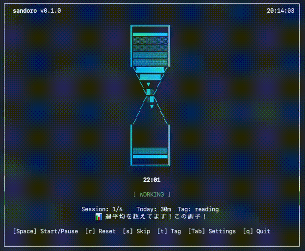
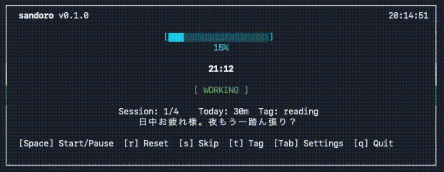
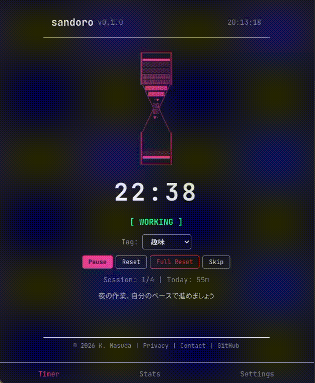

<div align="center">

# 🏜️ sandoro

**Terminal-first Pomodoro timer with beautiful ASCII art animations**

**ターミナルファーストの美しいASCIIアートアニメーション付きポモドーロタイマー**

[](https://github.com/masukai/sandoro/actions/workflows/ci.yml)
[](https://opensource.org/licenses/MIT)
[](https://www.rust-lang.org/)
[](https://react.dev/)

<br />

### ⏳ CLI - Hourglass Mode



### 📊 CLI - Progress Bar Mode



### 🌐 Web App



<br />

**[🌐 Try Web App](https://sandoro.vercel.app)** · **[📦 Releases](https://github.com/masukai/sandoro/releases)** · **[📖 Docs](docs/)**

</div>

---

<details>
<summary><strong>🇯🇵 日本語</strong></summary>

## 特徴

| Feature | Description |
|---------|-------------|
| 🎨 **美しいアニメーション** | Unicode文字（`░▒▓█`）による4フェーズのスムーズなアニメーション |
| 🖥️ **CLI & Web** | ターミナルでもブラウザでも同じ体験。PWA対応でオフライン動作 |
| 🔒 **プライバシー重視** | データはすべてローカル保存。トラッキングなし |
| ⚙️ **カスタマイズ** | 作業/休憩時間、テーマ、アクセントカラー、アイコンを自由に設定 |
| 📊 **進捗トラッキング** | ヒートマップ、ストリーク、目標設定、タグ別統計 |
| 🔔 **通知 & サウンド** | セッション完了時に通知・サウンドでお知らせ |
| 🏷️ **タグ機能** | 作業内容をタグで分類し、タグ別の統計を確認 |
| 💬 **コンテキストメッセージ** | 時刻・状態に応じた気の利いた一言表示 |
| 📤 **シェア機能** | 頑張りをSNSでシェア |
| ✏️ **履歴編集** | 過去のセッションのタグ変更・削除 |

## クイックスタート

### Web版（インストール不要）

👉 **[sandoro.vercel.app](https://sandoro.vercel.app)** - PWAとしてオフラインでも利用可能

### CLI版

```bash
# Homebrew (macOS/Linux)
brew tap masukai/sandoro && brew install sandoro

# Cargo (Rust)
cargo install sandoro

# 使い方
sandoro           # タイマー起動
sandoro stats     # 統計表示
```

## キーボードショートカット

| キー | 操作 |
|:---:|------|
| `Space` | 開始 / 一時停止 |
| `r` | リセット |
| `R` | フルリセット（セッション数も） |
| `s` | スキップ |
| `t` | タグ切り替え |
| `Tab` | 設定画面 |
| `q` | 終了 |

## アイコンスタイル

| アイコン | 説明 |
|---------|------|
| ⏳ **Hourglass** | 砂が落下/上昇する4フェーズアニメーション |
| 🍅 **Tomato** | チェリートマトが揺れるアニメーション |
| ☕ **Coffee** | 湯気が立ち上るアニメーション |
| 📊 **Progress** | シンプルなプログレスバー |

## テーマ & カラー

- **7テーマ**: Default, Nord, Dracula, Solarized, Gruvbox, Monokai, Tokyo Night
- **10アクセントカラー**: Cyan, Purple, Pink, Orange, Green, Blue, Indigo, Yellow, Red, Rainbow

## 統計機能

- **ヒートマップ**: GitHub草グラフ風の活動可視化
- **ストリーク**: 連続日数の記録
- **目標設定**: 日次/週次のセッション数・作業時間目標
- **期間比較**: 今週vs先週、今月vs先月の統計比較
- **タグ別統計**: タグごとの作業時間を可視化
- **エクスポート**: JSON/CSV形式での出力（CLI）

## 設定

| 設定 | 説明 | デフォルト |
|------|------|-----------|
| Work Duration | 作業時間（分） | 25 |
| Short Break | 短い休憩（分） | 5 |
| Long Break | 長い休憩（分） | 15 |
| Sessions | 長い休憩までのセッション数 | 4 |
| Auto Start | 自動で次のセッション開始 | OFF |
| Notifications | セッション完了時の通知 | ON |
| Sound | セッション完了時のサウンド | ON |

## プライバシー

**すべてのデータはデバイス内に保存されます**

- CLI: `~/.sandoro/` 内のSQLiteデータベース
- Web: ブラウザのlocalStorage
- 外部への通信なし
- トラッキング・解析なし

</details>

---

<details open>
<summary><strong>🇺🇸 English</strong></summary>

## Features

| Feature | Description |
|---------|-------------|
| 🎨 **Beautiful Animations** | 4-phase smooth ASCII art animations using Unicode gradients (`░▒▓█`) |
| 🖥️ **CLI & Web** | Same experience in terminal and browser. PWA support for offline use |
| 🔒 **Privacy-First** | All data stays local. No tracking, no analytics, no cloud required |
| ⚙️ **Customizable** | Work/break durations, themes, accent colors, and icon styles |
| 📊 **Track Progress** | Heatmaps, streaks, goals, and tag-based statistics |
| 🔔 **Notifications & Sound** | Get notified when sessions complete |
| 🏷️ **Tags** | Categorize your work and view tag-based statistics |
| 💬 **Context Messages** | Time-aware encouraging messages |
| 📤 **Share** | Share your progress on social media |
| ✏️ **Edit History** | Change tags or delete past sessions |

## Quick Start

### Web (No installation required)

👉 **[sandoro.vercel.app](https://sandoro.vercel.app)** - Works offline as a PWA

### CLI

```bash
# Homebrew (macOS/Linux)
brew tap masukai/sandoro && brew install sandoro

# Cargo (Rust)
cargo install sandoro

# Usage
sandoro           # Start timer
sandoro stats     # Show statistics
```

## Keyboard Shortcuts

| Key | Action |
|:---:|--------|
| `Space` | Start / Pause |
| `r` | Reset timer |
| `R` | Full reset (including session count) |
| `s` | Skip to next phase |
| `t` | Cycle through tags |
| `Tab` | Settings |
| `q` | Quit |

## Icon Styles

| Icon | Description |
|------|-------------|
| ⏳ **Hourglass** | Sand falling/rising with 4-phase animation |
| 🍅 **Tomato** | Twin cherry tomatoes with wobble effect |
| ☕ **Coffee** | Rising steam animation |
| 📊 **Progress** | Clean progress bar |

## Themes & Colors

- **7 Themes**: Default, Nord, Dracula, Solarized, Gruvbox, Monokai, Tokyo Night
- **10 Accent Colors**: Cyan, Purple, Pink, Orange, Green, Blue, Indigo, Yellow, Red, Rainbow

## Statistics

- **Heatmap**: GitHub-style activity visualization
- **Streaks**: Track consecutive days
- **Goals**: Set daily/weekly session and time targets
- **Comparison**: This week vs last week, this month vs last month
- **Tag Statistics**: Visualize time spent per tag
- **Export**: JSON/CSV export (CLI)

## Configuration

| Setting | Description | Default |
|---------|-------------|---------|
| Work Duration | Minutes per work session | 25 |
| Short Break | Minutes for short break | 5 |
| Long Break | Minutes for long break | 15 |
| Sessions | Sessions until long break | 4 |
| Auto Start | Auto-start next session | OFF |
| Notifications | Notify on session complete | ON |
| Sound | Play sound on session complete | ON |

## Privacy

**Your data stays on your device.**

- CLI: SQLite database in `~/.sandoro/`
- Web: Browser localStorage
- No external data transmission
- No analytics or tracking

</details>

---

## What is Pomodoro? / ポモドーロとは？

<details>
<summary><strong>Learn more / 詳しく見る</strong></summary>

### English

**Pomodoro Technique** is a time management method developed by Francesco Cirillo:

```
Work 25min → Break 5min → Work 25min → Break 5min → ... → Long Break 15min
```

**Why it works:**
- 25 minutes is short enough to start, long enough to focus
- Regular breaks prevent burnout
- Visible progress motivates continuation

### 日本語

**ポモドーロ・テクニック**は、1980年代にフランチェスコ・シリロによって考案された時間管理術です：

```
🍅 作業25分 → ☕ 休憩5分 → 🍅 作業25分 → ☕ 休憩5分 → ... → 🛋️ 長い休憩15分
```

**なぜ効果的か：**
- 25分は「始めやすく、集中できる」ちょうどいい長さ
- 定期的な休憩で疲労を防止
- 達成が見えるのでモチベーション維持

</details>

---

## Development / 開発

```bash
# Install all tools
mise install

# CLI development
cd cli && cargo run

# Web development
cd web && npm install && npm run dev
```

<details>
<summary><strong>Project Structure / プロジェクト構成</strong></summary>

```
sandoro/
├── cli/          # 🦀 Rust CLI (ratatui)
├── web/          # ⚛️  React Web (Vite + TailwindCSS)
├── shared/       # 📦 Shared resources
└── docs/         # 📚 Documentation
```

</details>

---

## License

[MIT License](LICENSE) © 2025 K. Masuda

---

<div align="center">

**[⬆ Back to top / トップに戻る](#sandoro)**

Made with focus and ☕

[GitHub](https://github.com/masukai/sandoro) · [Issues](https://github.com/masukai/sandoro/issues)

</div>
