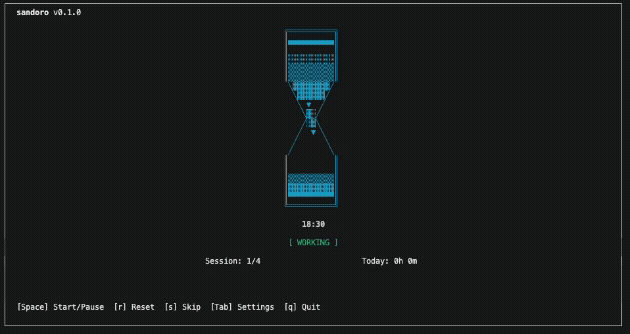

<div align="center">

# 🏜️ sandoro

**砂時計アニメーションが特徴的なポモドーロタイマー**

[](https://github.com/masukai/sandoro/actions/workflows/ci.yml)
[](https://opensource.org/licenses/MIT)
[](https://www.rust-lang.org/)
[](https://react.dev/)

<br />



*CLI & Web 両対応 • リッチなASCIIアートアニメーション • オフライン対応*

[Web版を試す](https://sandoro.app) · [リリース](https://github.com/masukai/sandoro/releases) · [ドキュメント](docs/)

</div>

---

## ✨ 特徴

<table>
<tr>
<td width="50%">

### 🎨 リッチなアニメーション

Unicode文字（`░▒▓`）によるグラデーション表現と4フェーズのスムーズなアニメーション

</td>
<td width="50%">

### 🖥️ CLI & Web

ターミナルでもブラウザでも同じ体験。PWA対応でオフラインでも動作

</td>
</tr>
<tr>
<td>

### 🎯 4種類のアイコン

- ⏳ **砂時計**: 砂が落下/上昇するアニメーション
- 🍅 **トマト**: 2つのチェリートマトが揺れる
- ☕ **コーヒー**: 湯気が立ち上る/注がれる
- 📊 **プログレス**: シンプルな進捗バー

</td>
<td>

### 🎨 カラーテーマ

Nord, Dracula など人気テーマに対応。お好みの配色で作業できます

</td>
</tr>
</table>

---

## 🖼️ スクリーンショット

### CLI版

```
╔══════════════════════════════════════════════════════════════════════════╗
║  sandoro                                                         v0.1.0  ║
╠══════════════════════════════════════════════════════════════════════════╣
║                                                                          ║
║                           ╔════════════╗                                 ║
║                           ║░░░░░░░░░░░░║                                 ║
║                           ║░░░░░░░░░░░░║                                 ║
║                           ║▒▒▒▒▒▒▒▒▒▒▒▒║                                 ║
║                           ║▒▒▒▒▒▒▒▒▒▒▒▒║                                 ║
║                            ╲▓▓▓▓▓▓▓▓▓▓╱                                  ║
║                             ╲▓▓▓▓▓▓▓▓╱                                   ║
║                              ╲  ▼·  ╱    ← 落下する砂                    ║
║                               ╲    ╱                                     ║
║                               ╱    ╲                                     ║
║                              ╱  ░▒  ╲                                    ║
║                             ╱        ╲                                   ║
║                            ╱          ╲                                  ║
║                           ║            ║                                 ║
║                           ║            ║                                 ║
║                           ║            ║                                 ║
║                           ║▀▀▀▀▀▀▀▀▀▀▀▀║                                 ║
║                           ╚════════════╝                                 ║
║                                                                          ║
║                              24:35                                       ║
║                           [ WORKING ]                                    ║
║                                                                          ║
║                        Session 1/4 │ Today: 2h 30m                       ║
║                                                                          ║
╠══════════════════════════════════════════════════════════════════════════╣
║   [Space] Start/Pause   [r] Reset   [s] Skip   [Tab] Settings   [q] Quit ║
╚══════════════════════════════════════════════════════════════════════════╝
```

<details>
<summary>🍅 トマトアイコン</summary>

```
              ~~~~  ~~~~
             (    )(    )
              \  /  \  /
          ═══════════════════
               🍅    🍅
            ╭──────────────╮
            │ ◉  ◉    ◉  ◉ │
            │   🌱      🌱  │
            ╰──────────────╯
```

</details>

<details>
<summary>☕ コーヒーアイコン</summary>

```
            ～  ～  ～
             ～  ～
              ～
          ╭──────────╮
          │▓▓▓▓▓▓▓▓▓▓│──╮
          │▓▓▓▓▓▓▓▓▓▓│  │
          │▒▒▒▒▒▒▒▒▒▒│──╯
          │░░░░░░░░░░│
          ╰──────────╯
         ══════════════
```

</details>

---

## 🚀 インストール

### CLI版

<details open>
<summary><strong>macOS / Linux (Homebrew)</strong></summary>

```bash
brew tap masukai/sandoro
brew install sandoro
```

</details>

<details>
<summary><strong>Rust (Cargo)</strong></summary>

```bash
cargo install sandoro
```

</details>

<details>
<summary><strong>直接ダウンロード</strong></summary>

[GitHub Releases](https://github.com/masukai/sandoro/releases) から最新のバイナリをダウンロード

| OS | Architecture | ダウンロード |
|----|--------------|-------------|
| macOS | Apple Silicon | `sandoro-darwin-arm64` |
| macOS | Intel | `sandoro-darwin-amd64` |
| Linux | x86_64 | `sandoro-linux-amd64` |

</details>

### Web版

👉 **[sandoro.app](https://sandoro.app)** にアクセス（インストール不要）

PWAとしてインストールすれば、デスクトップアプリのように使えます。

---

## 📖 使い方

### 基本操作

```bash
# タイマーを開始
sandoro

# カスタム設定で開始
sandoro start --work 30 --short-break 10 --long-break 20
```

### キーボードショートカット

| キー | 操作 |
|:----:|------|
| `Space` | 開始 / 一時停止 |
| `r` | リセット |
| `s` | スキップ |
| `Tab` | 設定画面 |
| `q` | 終了 |

### 設定

```bash
# アイコンとテーマを変更
sandoro config --icon tomato --theme dracula

# 統計を表示
sandoro stats --week
```

---

## 🛠️ 開発

### 必要なツール

- [mise](https://mise.jdx.dev/) - ツールバージョン管理

```bash
# 全ての開発ツールをインストール
mise install
```

### 開発コマンド

```bash
# CLI版
cd cli
cargo run        # 実行
cargo test       # テスト
cargo clippy     # リント

# Web版
cd web
pnpm install     # 依存関係インストール
pnpm dev         # 開発サーバー起動
pnpm test        # テスト
pnpm build       # ビルド
```

---

## 📁 プロジェクト構成

```
sandoro/
├── cli/          # 🦀 Rust CLI (ratatui)
├── web/          # ⚛️  React Web (Vite + TailwindCSS)
├── shared/       # 📦 共有リソース
└── docs/         # 📚 ドキュメント
```

---

## 📄 ライセンス

[MIT License](LICENSE) © 2025 masukai

---

<div align="center">

**[⬆ トップに戻る](#-sandoro)**

Made with ❤️ and ☕

</div>
